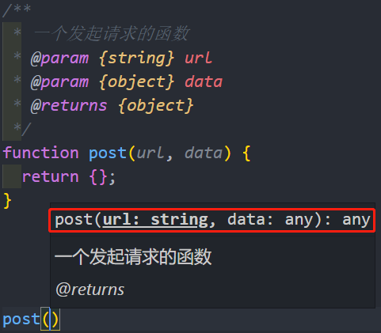
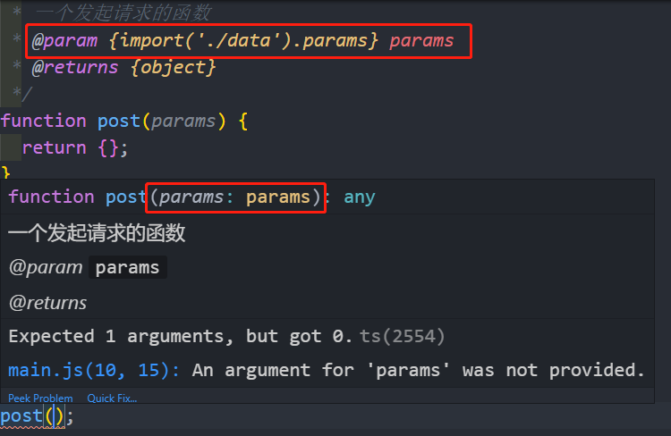
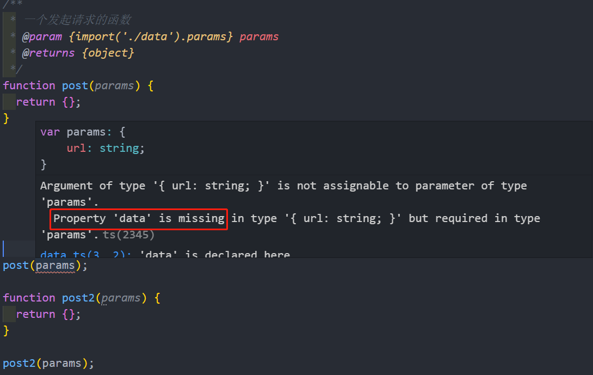

# 介绍

## 前言

在前端飞速发展的现在，使用 TypeScript 来编写前端或 node 程序越来越被人所接受，弱类型的 JavaScript 虽然非常灵活，也给开发者带来了不少困扰，TypeScript 则提供了丰富的类型定义，来解决 JavaScript 的弱类型问题。

但是**现有的庞大的代码经不起大量的重构**，那么使用强大的 vscode 编辑器加上 jsdoc 功能，能让你在不修改现有代码的基础上，在 JavaScript 的项目中也能享受 TypeScript 带来的类型提醒和报错。

## 你能得到什么

以下罗列了一些使用 jsdoc 的好处，当然最直接的好处就是在维护和多人协作的时候，对编写代码做出有效的提示，不使用 TypeScript 的情况下也可以提供很好的提示，但 TypeScript 提供了的类型更为丰富和类型检测。

### 友好的代码提示

### 随意地在现有的项目使用 TypeScript

在编辑器对函数的提示中，检测出函数的参数是从 TypeScript 文件中导出的一个类型

### 不影响原代码的情况下，享受 TypeScript 带来的强类型检测

图中，调用 post 函数的时候，编辑器检测出传入的参数 params 缺少 data 属性而报错，而调用 post2 的时候就没有报错。

