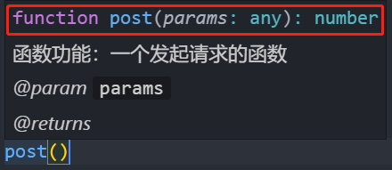
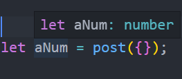
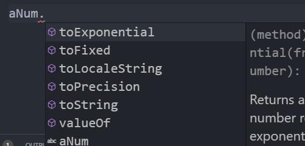
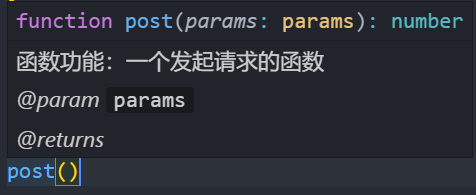
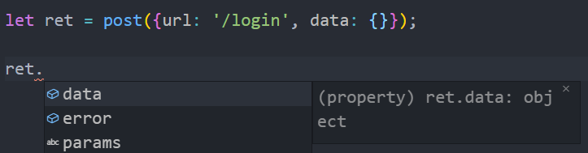
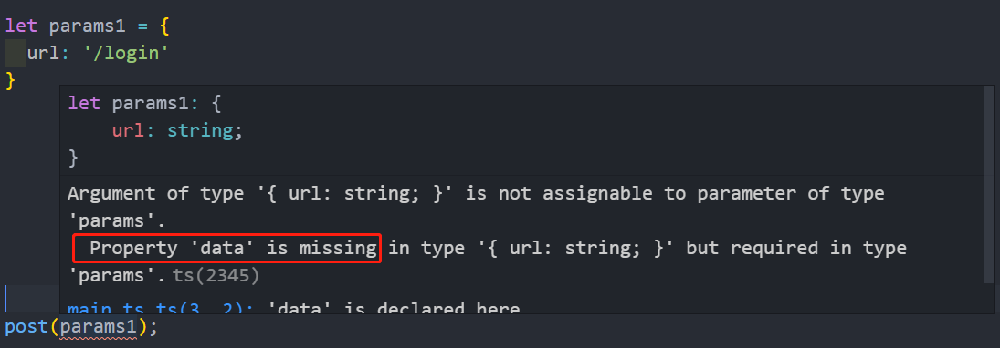

# 使用指南

## 使用 jsdoc

举例说明 jsdoc 的基本用法

建立一个项目 demo，再建立文件 main.js 项目结构如下：

``` js
└─ demo
	└─ main.js
```

在 main.js 文件里加上代码

```  js
/**
 * 函数功能：一个发起请求的函数
 * @param {object} params
 * @returns {number}
 */
function post(params) {
	return 1;
}
```

然后在**调用**这个函数的时候会得到提示，意味着这个函数接受一个参数，参数的类型是对象，而对象的具体类型没有指定，所以是 any，这个函数返回一个 number 类型的数。

``` js
function post(params: any): number
```



当指定一个变量接收返回值的时候，这个变量就会被推导为 number 类型



对返回值读取属性的时候，也会列出推导出的所有的属性



## 结合 TypeScript

上面是 jsdoc 的基本用法，在一般的场景中，也已经满足了所有的用法，当结合了 TypeScript 时，会使内容更加丰富，且会使注释的内容变得简洁。若暂无 TypeScript 需求的同学可以直接跳到 [jsdoc Api](../jsdoc)

在 demo 文件夹下建立 main.ts 文件，目录结构如下

``` js
└─ demo
	├─ main.js
	└─ main.d.ts
```

在 main.ts **导出类型**

``` js
export declare interface params {
	url: string
	data: object
}

export declare interface ret {
	error?: string
	data: object
}
```

在 main.js 的注释中**引入类型** main.ts 中的 params

``` js
/**
 * 函数功能：一个发起请求的函数
 * @param {import('./main_ts').params} params
 * @returns {import('./main_ts').ret}
 */
function post(params) {
	return {
    data: {}
	};
}
```

此时调用 post 函数时，会提示需要传入 params 类型的对象



返回值**读取属性**时，会提示在 ts 文件中农定义好的类型



## 参数类型检测

当在项目中配置了 jsconfig.json 之后，写在注释中的类型不再是简单的提示，当类型不匹配的时候，编辑器会给出相应的提示

::: tip
实际上 jsconfig.json 配置，指的是 TypeScript 的配置文件 tsconfig.json 设置了属性 allowJs 为 true.
:::

在 demo 目录下创建文件 jsconfig.json

``` js
└─ demo
	├─ main.js
	├─ main.ts
	└─ jsconfig.json
```

写入配置

``` js
// 若想修改配置可以查看 TypeScript 官方文档
{
	"compilerOptions": {
		"target": "esnext",
		"checkJs": true
	},
	"include": [
		"./main.js"
	]
}
```

然后使用缺少 data 的参数调用 main.js 中的 post 函数，会给出错误，传入的参数缺少 data 属性

